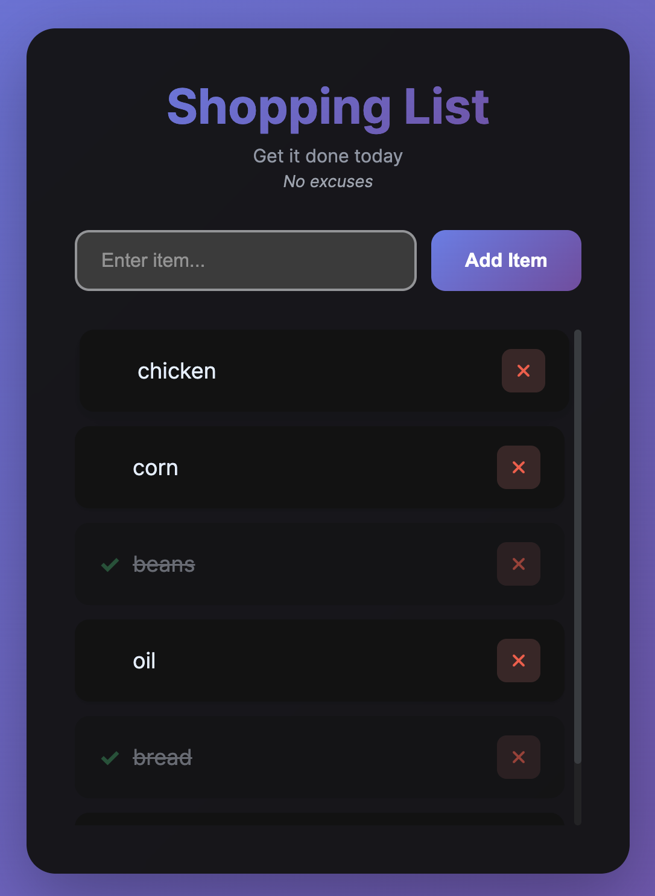

# 🛒 Shopping List

A modern, animated shopping list app with persistent storage.

**[View Project](https://jjxmori.github.io/shopping-list/)**

## Features

-   ✅ Click tasks to mark them complete
-   🎉 Fun confetti animations
-   💾 Auto-saves to localStorage
-   🗑️ Easy delete functionality
-   📱 Mobile responsive

## How to Use

1. Type an item and press Enter or click "Add Item"
2. Click any task to mark it done
3. Click the trash icon to delete
4. Your list saves automatically

## Installation

```bash
git clone https://github.com/jjxmori/shopping-list.git
cd shopping-list
```

Open `index.html` in your browser. That's it!

## Tech Stack

-   HTML/CSS/JavaScript
-   LocalStorage API
-   Font Awesome Icons

## Screenshots



---

Made by [@jjxmori](https://github.com/jjxmori)
